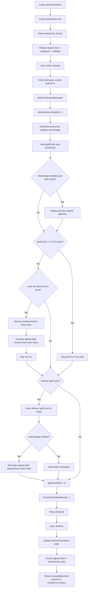

# Accumulation Logic Flow

This document describes the current 3-stage accumulation architecture implemented in:

- `src/hooks/use-accumulation.ts`
- `src/lib/accumulation-logic.ts`

## Three Stages

### 1. Pre-calculation data

`useAccumulation` is responsible for preparing calculator input.

It:

- loads `investments`
- loads `investment_history`
- reconstructs the latest debt state
- loads the current category distribution
- accepts the user-entered amount
- fetches and parses the current gold price
- passes a clean `PreCalculationInput` object into the pure calculator

### 2. Pure calculation logic

`calculateAccumulation(...)` is the pure stage-2 engine.

It:

- distributes the period amount by category percentage
- interprets the signed debt direction
- handles repayment first
- decides whether gold can borrow from stock
- buys gold only in `0.5 chi` units
- transfers leftover gold-side cash into stock
- enforces the final invariants

### 3. Result formatting

`formatCalculationResult(...)` converts the raw result into UI-facing output.

It builds:

- the human-readable action summary
- the final allocation table rows
- the debt display label and amount
- the confirmed transaction object used by the UI and history

## Signed Debt Model

The app now uses one signed debt value as the source of truth:

- positive debt: `Gold owes Stock`
- negative debt: `Stock owes Gold`
- zero debt: no outstanding inter-fund debt

For database compatibility, the app still derives the old directional columns when writing history rows.

## Core Rules

- Gold can only be purchased in `0.5 chi` increments.
- The buy threshold per unit is `goldPrice * 0.5`.
- Interchange is controlled only by the user setting.
- Repayment happens before any new gold purchase logic.
- Partial repayment is allowed.
- If gold repays an existing `Gold owes Stock` debt this period, gold cannot borrow from stock again in that same period.
- Leftover gold cash may still be moved into stock and create opposite-direction debt.
- Final `goldCashAfter` must be `0`.
- No cash bucket is allowed to go negative.

## Runtime Flow

### 1. Load state

When `useAccumulation` starts:

- it loads the user's `investments` row
- it loads `investment_history` rows newest first
- it rebuilds the latest signed debt from history first, then from `investments.state` as fallback
- it restores the saved category distribution and interchange toggle

### 2. Build calculator input

When the user enters an amount:

- the hook fetches the latest gold price
- it parses the numeric price
- it combines:
  - user amount
  - categories
  - gold price
  - latest signed debt
  - user interchange setting

That becomes `PreCalculationInput`.

### 3. Run the pure engine

The pure engine processes the period in this order:

#### A. Distribute money

- split the input amount by category percentage
- seed `goldCash` from the gold allocation
- seed `stockCash` from the stock allocation

#### B. Repay previous debt first

If interchange is enabled and debt exists:

- positive debt: gold repays stock using available `goldCash`
- negative debt: stock repays gold using available `stockCash`

Partial repayment is allowed.

#### C. Prioritize building gold

After repayment:

- if gold cash is enough for at least `0.5 chi`, buy as many full `0.5 chi` units as possible
- if gold cash is short, gold may borrow from stock only when:
  - interchange is enabled
  - stock has enough cash
  - gold did not already repay an existing positive debt this period

#### D. Flush leftover gold cash

If any gold-side cash remains after buying:

- move it into stock
- if interchange is enabled, that transfer updates signed debt
- `goldCashAfter` must end at `0`

### 4. Format and persist

After stage 2:

- `formatCalculationResult(...)` creates the action text and display data
- confirming the proposal updates local state
- `investments.state` stores the latest signed debt
- `investment_history` still receives derived directional columns for compatibility

## Mermaid Flowchart

